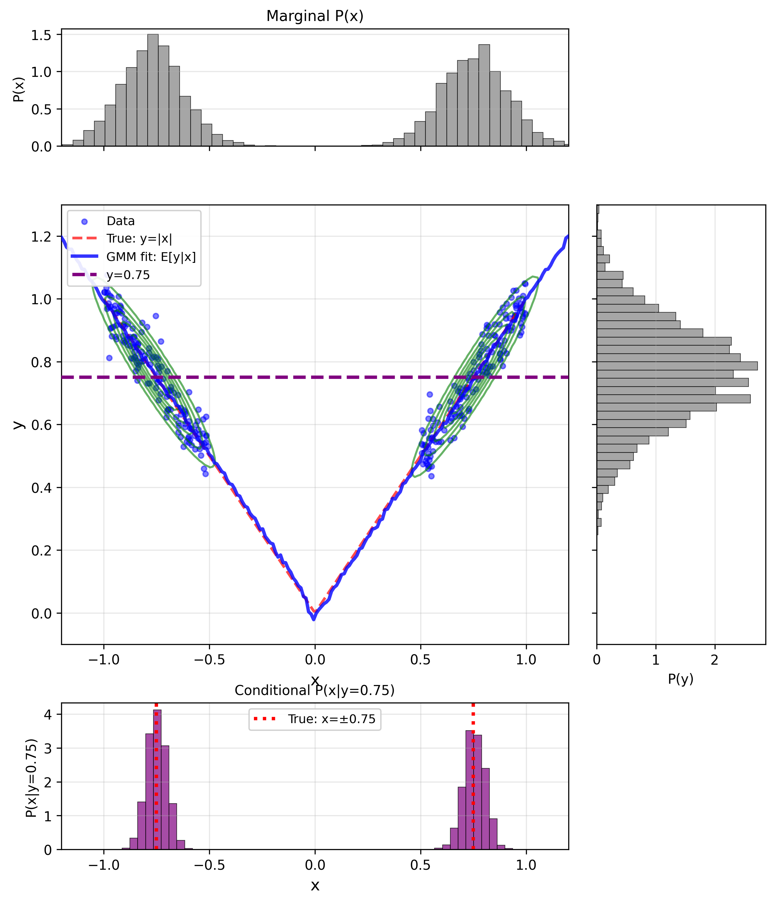
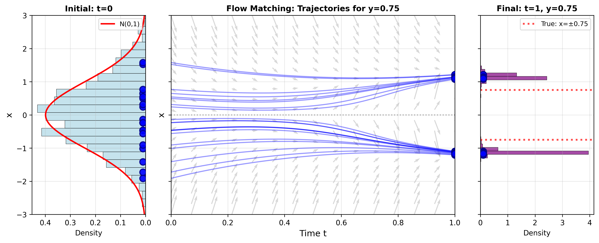
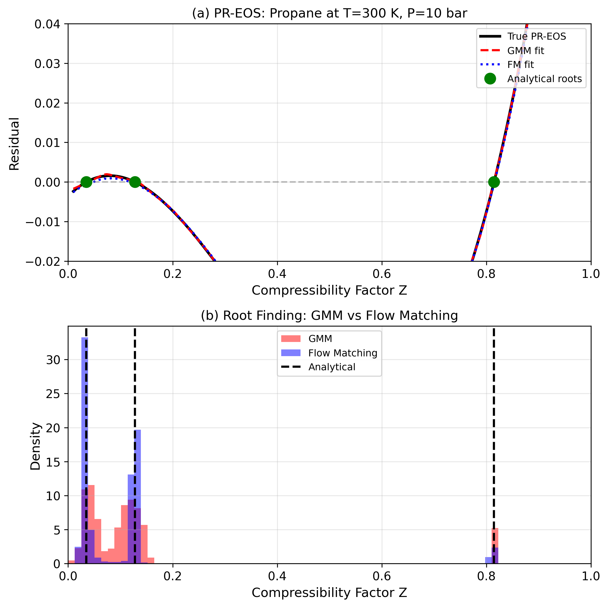
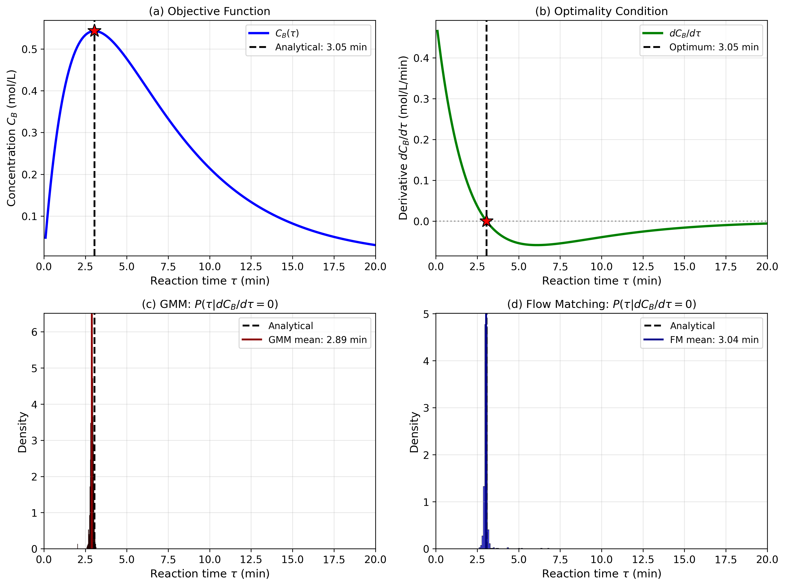
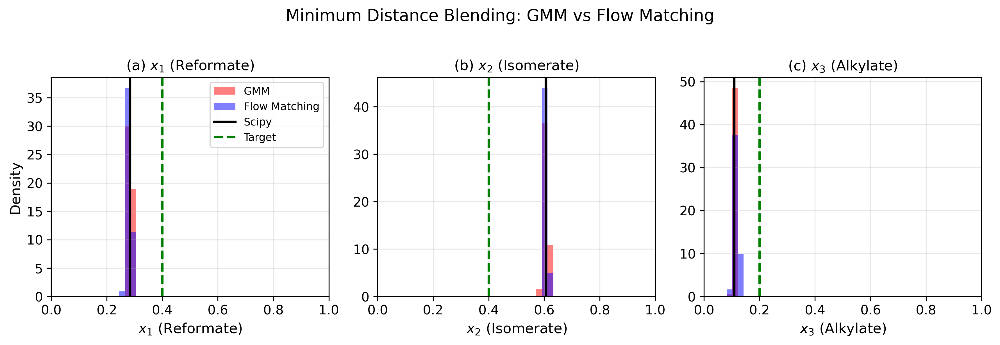
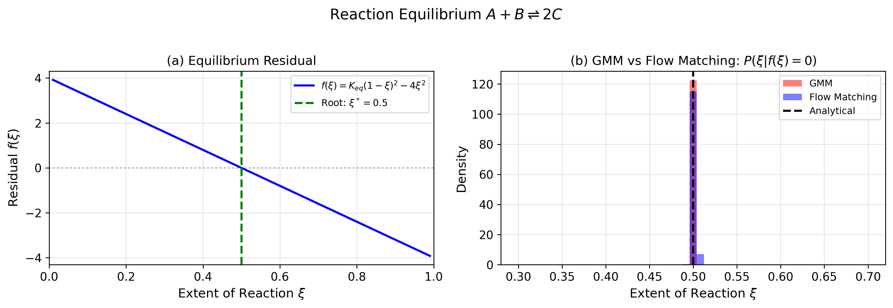
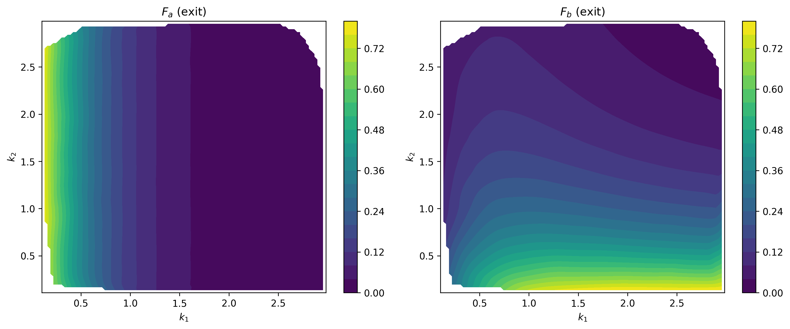
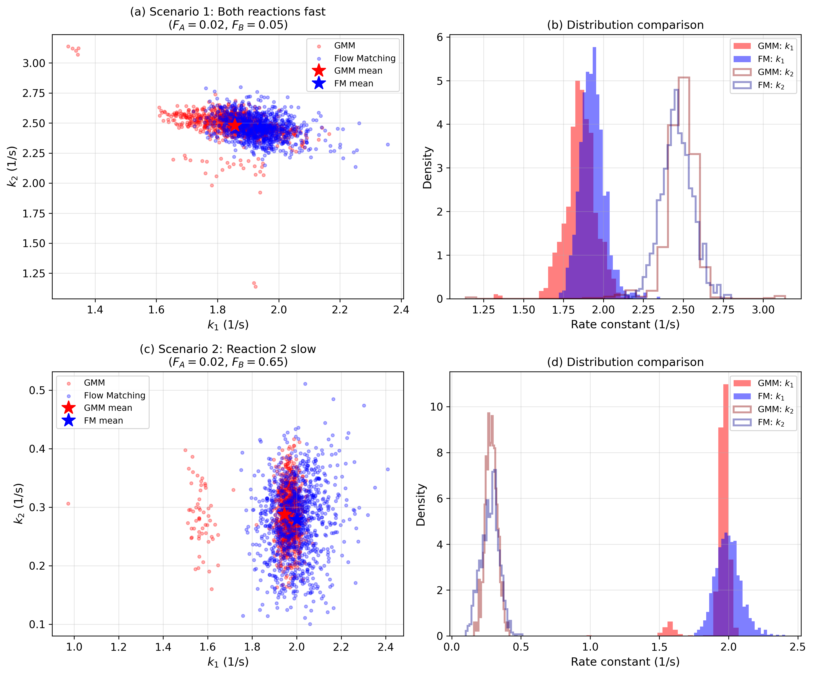
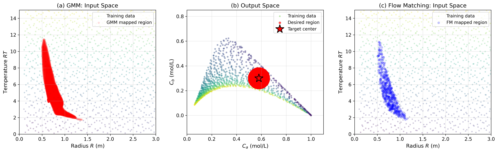

#+title: Generative machine learning approaches to optimization
#+options: toc:nil
#+author: Victor Alves and John R. Kitchin

\maketitle

#+BEGIN_abstract
Solving optimization problems, especially for nonlinear and constrained systems, is a challenge. Decades of specialized algorithms have been developed for general and special cases of root finding, minimization (including constraints), for parameter estimation, and mapping connected spaces. These approaches typically require a model, or set of equations, and then analytical, or iterative numerical approaches can be used to find a solution, and in some special cases a globally best solution can be found and proven. In this work we present an alternative approach to solving these problems that is based in generative machine learning models. The idea is these models either estimate a joint probability distribution of input and output variables, or are able to transform a distribution of inputs to a distribution of outputs (or vice versa). Then, by suitable conditioning (specifying desired properties of some variables), the solutions to these problems can be obtained by sampling the distribution, or by transformation of a distribution sample to the solution space. We illustrate the approach with Gaussian mixture models, which approximate the joint probability distribution. We show examples in root finding, unconstrained and constrained optimization, parameter estimation and mapping input and output spaces. This work is intended to be pedagogical to show how a generative model can be used to solve problems in optimization. We discuss some limitations of this approach, but conclude the approach has promise and is different than existing approaches.
#+END_abstract

* Introduction

The field of optimization is immense, with elegant solutions tailored to specific problem applications, depending on the nature of the objective function and constraints that are to be solved (e.g., linear /vs./ nonlinear, convex /vs./ nonconvex, differentiable /vs./ nondifferentiable), the nature of the variables involved in the optimization problem (discrete, continuous, or both), and lastly, the nature of the solution itself, global /vs./ local optimization. This myriad of problems that arise in many fields of science and engineering gave birth to several solution techniques, ranging from the seminal work of linear programming and the Simplex method by Dantzig cite:&dantzig1990origins, to the advent of robust nonlinear programming techniques including sequential quadratic programming (SQP) cite:&Han1977;&powell_sqp_1978;&Wilson1963Simplicial, and the popularization of interior-point methods cite:&wachter2006implementation. Additionally, solutions of mixed integer nonlinear programming (MINLP) algorithms cite:&bonami2008 and recent innovations on generalized disjunctive programming (GDP) which embeds logical decisions into mathematical programming formulations cite:&grossmann_gdp, and global optimization cite:&FLOUDAS20051185;&Floudas2009;&BOUKOUVALA2016701 are all examples of how rich is the literature on the topic.In Python the ~scipy~ library is particularly notable [[cite:&virtanen-2020-scipy]], but others also exist like ~Pyomo~ [[cite:&bynum-2021-pyomo-optim]], GEKKO [[cite:&beal-2018-gekko-optim-suite]], Gurobi cite:&gurobi, Mosek cite:&Andersen2000, and JuMP cite:&dunning-2017-jump. These libraries include both algebraic optimization modeling languages as well as commercial and/or open-source optimization solvers. Despite all the work aforementioned, the list is by no means exhaustive, and many other interesting research directions are currently available and being actively developed.

We see a particular interest in algorithmic development of solutions to optimization problems that are specific to the nature of the problem, its variables and local/optimal convergence criteria. However, less attention has been given to the use of emerging and powerful tools such as generative machine learning (genML) in the well-developed area of optimization. It is clear that optimization/mathematical programming is one of the cornerstones of machine learning (independent of the generative nature or lack thereof), but the reverse application, that is, genML as a tool to solve optimization problems, seems to be largely unexplored.

To orient the reader on where a generative-based optimization approach fits in the optimization landscape, we illustrate genML-opt in Figure ref:fig:opt_flowchart, based on the classification of optimization problems in Ref. citenum:&biegler2004_retrospective. We intentionally modified the original flowchart in Refs. citenum:&biegler2004_retrospective;&neos_optimization_types  to show which class of problems we are able to currently employ genML-opt. Although promising, there is still a lot to cover when compared to the current state-of-the-art in optimization.

#+name: fig:opt_flowchart
#+caption: Tree containing classes of optimization problems, based on flowcharts available in the literature cite:&biegler2004_retrospective;&neos_optimization_types. We show with connected dashed lines and also highlighting classes of optimization problems that we were able to currently solve using generative machine learning applied to optimization - GenML-opt.
[[./optimization_flowchart.pdf]]

In this manuscript we explore a different way to think about optimization through generative machine learning (genML) [[cite:&gm-2020-compr-survey]]. The basic concept in genML is that if one knows the joint probability distribution of a set of variables, then it is possible to generate samples of that distribution. Alternatively, if one knows how to transform a reference distribution to the joint probability distribution of those variables, then one samples the reference distribution and transforms it to a sample of the desired distribution.

In fact, generative models have been applied to optimization problems before. Invertible neural networks are a special class of models that are used to model the joint distribution of inputs and outputs [[cite:&ardizzone-2019-analy-inver]]. Once they are trained, feasible solutions can be found by sampling them. Diffusion models have been applied to inverse problems in mechanics [[cite:&dasgupta-2025-condit-score]]. We recently applied genML to solve an inverse linear problem [[cite:&kitchin-2025-solvin]]. Generative models can also be used to enhance combinatorial optimization problems [[cite:&alcazar-2024-enhan-combin]] where they can be used to generate near-optimal solutions that are subsequently refined by conventional algorithms. Finally, generative adverserial models have been used in optimization [[cite:&yao-2024-gener-adver]]

Probably the most common genML method used today is in the generation of text [[cite:&becker-2024-text-gener]] and images [[cite:&elasri-2022-image-gener]]. Large language models (LLMs) are a form of genML where the most likely sequence of words to follow a prompt is generated. LLMs are not the focus of this work. In image generation, a genML model is trained on a large set of images to "learn the image distribution", and then images are generated by sampling that distribution. We find it helpful to think of an image first as a matrix of pixel values (e.g. the RGB intensities), and then to think of that matrix as a flattened vector. Then, a large set of images will have a distribution of values in that vector space where there are correlations (covariance) between the elements of the vector that define an image space. Thus, one generates a sample vector, and then reshapes it into a matrix, which can be visualized as an image.  This is the motivation for the present work.

That does not sound immediately helpful in solving optimization problems until we note two things. First, instead of a collection of pixel values, the vector elements  may be inputs and outputs of a model or system, and by concatenating those we obtain a vector analogous to the flattened image vector. The vector elements may even include derivatives of the model, or other easily derived features. If we have a large number of these vectors, then they will form a distribution in that vector space where there are correlations (covariance) between the elements, e.g. the inputs and outputs. Since it is evident generative models can learn that distribution for images, it seems reasonable they could learn this distribution for inputs/outputs, which we demonstrate in this work.

Thus, if we can learn or estimate the joint probability distribution, we can generate samples of inputs and outputs from it. Second, we must introduce the idea of conditional generation, that is, we can specify some values of the variables, update the joint probability distribution of the remaining variables, and then generate those variables consistent with our condition. Thus, if we condition on inputs, we can then generate samples of the output, and vice versa. This is directly related to root finding; we might condition on the output being zero, and generate the inputs that lead to that result.

To connect this idea to finding minima/maxima we simply need to see the connection between inputs of a model and its derivatives. If we know that joint probability distribution, then we generate samples conditioned on the derivatives being equal to zero. We can include constraints by leveraging a Lagrangian function, or another augmented function and condition the derivatives of that to be zero. Finally, in parameter estimation, we need the joint probability distribution between the parameters and an observed output(s). Then to estimate parameters from an observation, we simply condition on the observation to find the parameters. These are all related to solving inverse problems in optimization.

An alternative approach to generative modeling is to transform a simple distribution into a more complex distribution. In diffusion and flow-matching models, this transformation is learned from data, and then it is used conditionally to generate samples of a target distribution (e.g. the outputs) from samples of a simpler distribution such as a normal distribution.

We think this approach is fundamentally different than a conventional view point. There may be a model involved, but it is not necessary; the approach can be completely data-driven in some cases. We do not need to think about a forward or inverse model. The joint probability distribution (or the transformation function) is simultaneously both of these; conditioning determines what direction if any one thinks in (for example, it is possible to condition on some inputs and outputs). That means we get solutions to optimization problems without using conventional approaches like Newton-Raphson iterative methods, or other specialized algorithms like simplex methods to solve nonlinear programs. We make no claims of superiority of generative methods over the well-established methods; indeed, conventional algorithms offer many advantages to the ideas presented here. Instead, we focus on developing a proof of concept for a new way to think about solving these problems. We do this through a series of examples that span root finding, minimization including constraints, parameter estimation, and state mapping.

GenML has the potential to serve as an alternative optimization solution approach to several classes of problems listed above, including linear and nonlinear programming (both constrained and unconstrained), parameter estimation problems, inverse mapping, and root finding, to name a few. Intriguingly, we have observed that the solution approach to these types of problems is remarkably consistent, as opposed to highly-tailored and specific algorithms (the current /status quo/) as long as data is available. We do not anticipate that generative machine learning formulations will replace classic mathematical programming development. Instead, we believe that a branch of optimization problems that can be solved by using GenML will employ even more sophisticated optimization algorithms at the training and inference of generative models. In short, the optimization layer will always be present, and its interaction with the researcher/practitioner will be what might change within the next years.

* Methods

** Gaussian mixture models

Gaussian Mixture Models (GMMs) are a powerful and versatile mathematical tool that is able to characterize complex and multimodal distributions by combining multiple individual Gaussians. They are used in machine learning applications related but not limited to data clustering cite:&Yang_2019_ICCV;&viroli_deep_2019. They are also recognized in the literature related to pattern recognition in machine learning cite:&bishop2006pattern. Furthermore, in the field of robotics, Gaussian Mixture Regression (GMR) has been used as a generative modeling framework  cite:&Fabisch2021,  and it is considered a generative model cite:&deisenroth2020mathematicsML. We follow the notation from Ref citenum:&Fabisch2021 for the mathematical definition of GMMs. However, the reader should note that equally valid formulations are present in the literature cite:&deisenroth2020mathematicsML;&bishop2006pattern.

From a machine learning perspective, the main task is, given a pair of vectors $x$ and $y$, to learn a probability distribution as defined as in Eq. ref:eq:GMM_01, which is the definition of a Gaussian mixture model.

\begin{equation} \label{eq:GMM_01}
p(\boldsymbol{x}, \boldsymbol{y})=\sum_{k=1}^K \pi_k \mathcal{N}_k\left(\boldsymbol{x}, \boldsymbol{y} \mid \boldsymbol{\mu}_{\boldsymbol{x} \boldsymbol{y}_k}, \boldsymbol{\Sigma}_{\boldsymbol{x} \boldsymbol{y}_k}\right)
\end{equation}

\noindent In which $\mathcal{N}_k\left(\boldsymbol{x}, \boldsymbol{y} \mid \boldsymbol{\mu}_{\boldsymbol{x} \boldsymbol{y}_k}, \boldsymbol{\Sigma}_{\boldsymbol{x} \boldsymbol{y}_k}\right)$ are the $k^{th}$ Gaussian distributions in a mixture, which are defined by their respective means $\boldsymbol{\mu}_{\boldsymbol{x} \boldsymbol{y}_k}$ and covariances $\boldsymbol{\Sigma}_{\boldsymbol{x} \boldsymbol{y}_k}$. $\pi_k \in [0,1]$ are defined as \textit{weights} or \textit{priors}, which quantify the contribution of each Gaussian to the mixture model.

*** Training

The training step corresponds to obtaining an accurate prediction of this unknown, probably multimodal and multivariable probability distribution, given a dataset defined by the pair of vectors $x,y$. For simplicity, we can lump the parameters related to the formulation of Eq. ref:eq:GMM_01 which includes the means, covariances and mixture weights as $\theta := \left\{\pi_k, \boldsymbol{\mu}_{\boldsymbol{x} \boldsymbol{y}_k}, \boldsymbol{\Sigma}_{\boldsymbol{x} \boldsymbol{y}_k}: k=1, \ldots, K\right\}$

As a figure of merit is needed to fit this generative machine learning model, we resort to a likelihood formulation, defined as in Eq.ref:eq:logLL

\begin{equation} \label{eq:logLL}
p(x,y \mid \boldsymbol{\theta})=\prod_{n=1}^N p\left(x_n,y_n \mid \boldsymbol{\theta}\right), \quad p\left(x_n,y_n \mid \boldsymbol{\theta}\right)=\sum_{k=1}^K \pi_k \mathcal{N}\left(x,y \mid \boldsymbol{\mu}_k, \boldsymbol{\Sigma}_k\right)
\end{equation}

The log-likelihood cite:&deisenroth2020mathematicsML is formulated in Eq.ref:eq:logLL_2. Ideally, one could solve for $\mathrm{d} \mathcal{L} / \mathrm{d} \boldsymbol{\theta} = 0$ and the optimal parameters $\theta^*$ that maximizes the likelihood would be obtained analytically. However, since Eq. ref:eq:logLL_2 is not a closed-form expression/solution cite:&deisenroth2020mathematicsML, an iterative method is used. Expectation Maximization (EM) is applied in GMMs sucessfully and this is what packages such as \texttt{gmr} cite:&Fabisch2021 and the scikit-learn cite:&scikit-learn implementation of GMM does.

\begin{equation} \label{eq:logLL_2}
\log p(\boldsymbol{x,y} \mid \boldsymbol{\theta})=\sum_{n=1}^N \log p\left(\boldsymbol{x}_n \mid \boldsymbol{\theta}\right)=\underbrace{\sum_{n=1}^N \log \sum_{k=1}^K \pi_k \mathcal{N}\left(\boldsymbol{x}_n \mid \boldsymbol{\mu}_k, \boldsymbol{\Sigma}_k\right)}_{=: \mathcal{L}}
\end{equation}

*** Prediction

Following the conditional distribution property of each individual Gaussian, one is able to compute the conditional distribution $p(y \mid x,\theta)$ by first writing down the conditional distribution for a given $k^{th}$ element cite:&Fabisch2021.

\begin{equation}
\boldsymbol{\mu}_{\boldsymbol{xy}_k} =
\begin{bmatrix}
\boldsymbol{\mu}_{\boldsymbol{x}k} \\
\boldsymbol{\mu}_{\boldsymbol{y}k}
\end{bmatrix},
\quad
\boldsymbol{\Sigma}_{\boldsymbol{xy}_k} =
\begin{bmatrix}
\boldsymbol{\Sigma}_{\boldsymbol{xx}_k} & \boldsymbol{\Sigma}_{\boldsymbol{xy}_k} \\
\boldsymbol{\Sigma}_{\boldsymbol{yx}_k} & \boldsymbol{\Sigma}_{\boldsymbol{yy}_k}
\end{bmatrix}
\end{equation}

\noindent The conditional distribution of \(\boldsymbol{y}\) given \(\boldsymbol{x}\) for the $k^{th}$ Gaussian component is defined as in Eq.ref:eq:GMM_cond_01:

\begin{equation} \label{eq:GMM_cond_01}
\begin{aligned}
\boldsymbol{\mu}_{\boldsymbol{y} \mid \boldsymbol{x}}^{(k)} &= \boldsymbol{\mu}_{\boldsymbol{y}k} + \boldsymbol{\Sigma}_{\boldsymbol{yx}_k} \boldsymbol{\Sigma}_{\boldsymbol{xx}_k}^{-1}(\boldsymbol{x} - \boldsymbol{\mu}_{\boldsymbol{x}k}) \\
\boldsymbol{\Sigma}_{\boldsymbol{y} \mid \boldsymbol{x}}^{(k)} &= \boldsymbol{\Sigma}_{\boldsymbol{yy}_k} - \boldsymbol{\Sigma}_{\boldsymbol{yx}_k} \boldsymbol{\Sigma}_{\boldsymbol{xx}_k}^{-1} \boldsymbol{\Sigma}_{\boldsymbol{xy}_k}
\end{aligned}
\end{equation}

To obtain the full conditional distribution \(p(\boldsymbol{y} \mid \boldsymbol{x})\), we combine the component-wise conditional Gaussians using the posterior weights \(\pi_{k \mid \boldsymbol{x}}\), which represent the probability of component \(k\) given the observed \(\boldsymbol{x}\):

\begin{equation}
\pi_{k \mid \boldsymbol{x}} = \frac{\pi_k \, \mathcal{N}(\boldsymbol{x} \mid \boldsymbol{\mu}_{\boldsymbol{x}k}, \boldsymbol{\Sigma}_{\boldsymbol{xx}_k})}{\sum_{l=1}^K \pi_l \, \mathcal{N}(\boldsymbol{x} \mid \boldsymbol{\mu}_{\boldsymbol{x}l}, \boldsymbol{\Sigma}_{\boldsymbol{xx}_l})}
\end{equation}

Finally, the final predicted distribution corresponds to a mixture of conditional Gaussians:

\begin{equation}
p(\boldsymbol{y} \mid \boldsymbol{x}) = \sum_{k=1}^K \pi_{k \mid \boldsymbol{x}} \, \mathcal{N}(\boldsymbol{y} \mid \boldsymbol{\mu}_{\boldsymbol{y} \mid \boldsymbol{x}}^{(k)}, \boldsymbol{\Sigma}_{\boldsymbol{y} \mid \boldsymbol{x}}^{(k)})
\end{equation}

If one desires to have them in a more compact form, we refer to our previous definition of the lumped hyperparameters as $\theta$ as

\begin{equation}
    \theta =: \left\{ \pi_k, \boldsymbol{\mu}_{\boldsymbol{x} \boldsymbol{y}_k}, \boldsymbol{\Sigma}_{\boldsymbol{x} \boldsymbol{y}_k} \right\}_{k=1}^K
\end{equation}

\noindent which yields a predictive distribution form as in Eq. ref:eq:GMM_predict_compact.

\begin{equation} \label{eq:GMM_predict_compact}
p(\boldsymbol{y} \mid \boldsymbol{x}; \theta) = \sum_{k=1}^K \pi_{k \mid \boldsymbol{x}}(\theta) \, \mathcal{N}(\boldsymbol{y} \mid \boldsymbol{\mu}_{\boldsymbol{y} \mid \boldsymbol{x}}^{(k)}, \boldsymbol{\Sigma}_{\boldsymbol{y} \mid \boldsymbol{x}}^{(k)})
\end{equation}

Eq. ref:eq:GMM_predict_compact plays a major role in our work. As we draw samples based on conditioning, we can simultaneously infer in variables that belong to both the $x$ or $y$ spaces. We show this in several applications related to optimization.

Lastly, we note that typical optimization techniques are used, more specifically during the training step of the generative approach, namely the EM algorithm cite:&nips1993_EM. However, this optimization step that requires $\mathcal{O}(\mathcal{D}^3)$ for a dataset of dimensionality $\mathcal{D}$, is performed offline and separately from the applications in which the GM model is employed.

** Conditional normalizing flow matching

Flow matching is a simulation-free approach to training continuous normalizing flows cite:&lipman2023flow. Unlike traditional normalizing flows that require computing expensive Jacobian determinants, flow matching learns a time-dependent vector field $v_t(x)$ that transforms samples from a simple base distribution $p_0$ (typically $\mathcal{N}(0, I)$) to a target data distribution $p_1$ through ordinary differential equations (ODEs).

Given a data sample $x_1 \sim p_1(x)$ and a base sample $x_0 \sim p_0(x)$, we construct a probability path $p_t(x)$ for $t \in [0,1]$ that interpolates between the two distributions. A common choice is the conditional Gaussian path:
\begin{equation}
p_t(x | x_1) = \mathcal{N}(x | t x_1, (1-(1-\sigma)t)^2 I)
\end{equation}
where $\sigma$ is a small constant (typically $10^{-5}$) to ensure numerical stability.

The corresponding conditional vector field that generates this path is:
\begin{equation}
u_t(x | x_1) = \frac{x_1 - (1-\sigma)x}{1-(1-\sigma)t}
\end{equation}

For optimization problems, we extend flow matching to learn conditional distributions $p(x|c)$, where $x$ represents the decision variables and $c$ represents the conditioning information (e.g., constraint values, target objectives, or system parameters)  cite:&tong2023improving. This allows us to sample from different conditional distributions by simply changing the conditioning value.

The conditional flow matching objective is:
\begin{equation}
\mathcal{L}_\text{CFM}(\theta) = \mathbb{E}_{t, p_1(x_1,c), p_0(x_0)} \left[ \| v_\theta(x_t, c, t) - u_t(x_t | x_1) \|^2 \right]
\end{equation}
where $v_\theta(x_t, c, t)$ is the learned vector field parameterized by a neural network with parameters $\theta$, $t \sim \text{Uniform}(0,1)$ is the time variable, $x_t \sim p_t(x | x_1)$ is a sample along the flow path, and $(x_1, c)$ are paired samples from the training data.

We parameterize the vector field $v_\theta(x, c, t)$ using a multi-layer neural network with the following architecture: the Input (concatenation of $[x, c, t]$), the hidden layers (3 fully-connected layers with 64 units each and sigmoid activation functions), and the output (a vector field prediction $v \in \mathbb{R}^{d_x}$).

The choice of sigmoid activations (rather than ReLU) provides smooth gradients throughout the network, which is beneficial for learning continuous vector fields cite:&chen2018neural. The model is trained using the following procedure. First, for each training sample, we store the input-output pair $(x, c)$ where $x$ represents the solution and $c$ represents the conditioning information. During training, each mini-batch involves sampling data pairs $(x_1, c)$ from the training set, sampling base noise $x_0 \sim \mathcal{N}(0, I)$, and sampling time $t \sim \text{Uniform}(0,1)$. We then construct the intermediate state $x_t = t x_1 + (1-(1-\sigma)t)x_0$ and compute the target vector field $u_t(x_t | x_1) = \frac{x_1 - (1-\sigma)x_t}{1-(1-\sigma)t}$. The training objective minimizes the mean squared error between the predicted and target vector fields using the Adam optimizer~\cite{kingma2014adam} with learning rate $10^{-3}$. To improve training stability, all input features are standardized to have zero mean and unit variance before training.

Training typically requires 500 epochs with batch size 64 for the problems considered in this work. To generate samples from the learned conditional distribution $p(x|c)$, we solve the ODE:
\begin{equation}
\frac{dx}{dt} = v_\theta(x, c, t), \quad x(0) \sim \mathcal{N}(0, I)
\end{equation}
from $t=0$ to $t=1$ using the Euler method with $N=100$ steps:
\begin{equation}
x_{t+\Delta t} = x_t + v_\theta(x_t, c, t) \cdot \Delta t, \quad \Delta t = \frac{1}{N}
\end{equation}

The final state $x(1)$ represents a sample from $p(x|c)$. To obtain multiple samples, we simply repeat this process with different initial noise samples $x(0)$.

Conditional flow matching offers several advantages for optimization problems. First, unlike score-based models cite:&song2020score or traditional normalizing flows cite:&papamakarios2021normalizing, flow matching provides simulation-free training that does not require computing expensive score functions or Jacobian determinants during training. Second, the learned distribution naturally captures multi-modal solutions, enabling exploration of the entire solution space when constraints admit multiple feasible points. Third, the flexible conditioning mechanism allows rapid sampling of solutions for different problem instances by simply changing the conditioning value $c$ without retraining the model. Fourth, the distribution of samples provides natural uncertainty quantification for the solutions. For problems with missing data or regions of low sampling density, flow matching learns to interpolate smoothly through these regions by leveraging the continuous nature of the learned vector field.

** LLM usage

We used Claude Code with the Opus 4.5 model extensively to develop the code in this work and for literature review. The manuscript was largely written by the authors.  The GMM code used in this work was originally written by the authors, and then integrated into the work by Claude Code. The conditional normalizing flow code and the narrative describing it in the manuscript was created with Claude Code.

We note this here for two reasons. First is transparency. Second, we want to highlight how LLM usage enhanced and expanded the work. The first version of this work focused solely on the GMM approach with simpler examples. The use of an LLM enabled us to significantly expand the scope to include flow matching, and more sophisticated examples and visualization. The LLM also offers a new opportunity to engage with the work by "chatting" with the repository. We provide a ~SKILL.md~ file in the supporting repository that provides "Expert guidance for solving optimization problems using generative models (GMM and Flow Matching). Use when users need to solve optimization, inverse problems, or find feasible solutions under constraints using probabilistic sampling approaches.".

* Results and discussion
** Basic concepts of generative modeling

In generative modeling we have two options. First, we can develop a model of the joint probability distribution between inputs $x$ and outputs $y$. Then we can conditionally generate samples, e.g. at fixed $x$ or fixed $y$ by updating the joint probability to reflect the residual degrees of freedom. The Gaussian Mixture Model is a generative model like this where there are analytical formulas to update the probabilities. We illustrate this conceptually below in Figure ref:fig-gmm.

#+name: fig-gmm
#+caption: GMM fit for $y = |x|$ with missing data in the region $-0.5 \leq x \leq 0.5$. The central panel shows the data (blue points), true function (red dashed), GMM fit $E[y|x]$ (blue solid line), and GMM density contours (green). The marginal distributions $P(x)$ (top) and $P(y)$ (right) show the overall data distribution. The bottom panel shows the conditional distribution $P(x|y=0.75)$, which is bimodal with modes at $x \approx \pm 0.75$, demonstrating GMM's ability to capture multi-modal inverse solutions despite missing data.

The generative approach in conditional flow matching is different. Instead of updating the joint probability distributions these models learn a conditional velocity field that transforms one distribution (often a simple normal distribution) into the target distribution. We show a result for this below in Figure ref:fig-fm for the same problem we solved above with the GMM.

#+name: fig-fm
#+caption: Flow Matching trajectories for $y = |x|$ with missing data. Left panel shows the initial noise distribution $N(0,1)$ at $t=0$. Center panel shows 20 trajectories evolving from noise to data, conditioned on $y=0.75$, with gray arrows indicating the learned velocity field $v(x,t,y=0.75)$. Right panel shows the final conditional distribution $P(x|y=0.75)$ at $t=1$, which is bimodal with modes at $x \approx \pm 0.75$, matching the true inverse solutions. Flow Matching learns to transform a simple Gaussian into a complex bimodal distribution conditioned on the target value.

** Root finding  label:sec-root-finding

In root finding we seek values of $x$ where $f(x) = 0$. Traditional approaches include bisection, Newton-Raphson iteration, and polynomial root solvers. Here we demonstrate a generative approach where we learn the joint distribution $p(x, f(x))$ and then condition on $f(x) = 0$ to generate samples of the roots.

A practically relevant example is finding compressibility factors from the Peng-Robinson equation of state (PR-EOS), widely used in chemical engineering for vapor-liquid equilibrium calculations. In compressibility factor form, the PR-EOS is a cubic equation:

\begin{equation}
Z^3 - (1-B)Z^2 + (A - 3B^2 - 2B)Z - (AB - B^2 - B^3) = 0
\end{equation}

\noindent where $A = aP/(R^2T^2)$ and $B = bP/(RT)$ are dimensionless parameters computed from the substance's critical properties. In the two-phase region, this cubic has three real roots: the liquid compressibility factor $Z_L$, an unstable intermediate root, and the vapor compressibility factor $Z_V$. For propane at $T = 300$ K and $P = 10$ bar (in the two-phase region), we generate training data by evaluating the cubic residual $r(Z) = Z^3 - (1-B)Z^2 + (A - 3B^2 - 2B)Z - (AB - B^2 - B^3)$ over the domain $Z \in [0.01, 0.99]$. We then fit generative models to the joint data $[Z, r(Z)]$.

To find the roots, we condition on $r(Z) = 0$ and sample from the resulting conditional distribution $p(Z \mid r = 0)$. Figure ref:fig:pr-roots shows the conditional probability density, which exhibits three distinct peaks corresponding to the liquid ($Z_L \approx 0.046$), unstable ($Z \approx 0.20$), and vapor ($Z_V \approx 0.82$) roots. Cluster analysis of the samples yields:

\begin{center}
\begin{tabular}{lcc}
\hline
Root & GMM estimate & Analytical \\
\hline
$Z_{\text{liquid}}$ & $0.0459 \pm 0.0006$ & $0.0459$ \\
$Z_{\text{unstable}}$ & $0.1962 \pm 0.0095$ & $0.1966$ \\
$Z_{\text{vapor}}$ & $0.8201 \pm 0.0044$ & $0.8208$ \\
\hline
\end{tabular}
\end{center}

The generative approach naturally discovers all three roots simultaneously, whereas iterative methods like Newton-Raphson find only the root nearest to the initial guess and require multiple starting points to find all roots. The generative framework extends naturally to finding complex roots by treating real and imaginary parts as separate dimensions. An example of this can be found in the supporting information.

#+attr_latex: :placement [H]
#+name: fig:pr-roots
#+caption: Comparison of Gaussian Mixture Model (GMM) and Flow Matching (FM) approaches for root finding in the Peng-Robinson equation of state. (a) The PR-EOS cubic residual for propane at T = 300 K and P = 10 bar, showing the true function (black solid line) along with the learned fits from GMM (red dashed) and FM (blue dotted). Both generative models accurately capture the functional relationship between compressibility factor Z and the cubic residual. Green circles indicate the three analytical roots corresponding to liquid ($Z_L$ = 0.049), unstable ($Z_{unstable}$ = 0.161), and vapor ($Z_V$ = 0.803) phases. (b) Distribution of roots obtained by conditioning each model on residual = 0. Both methods successfully identify all three roots, with the GMM producing slightly sharper distributions due to its analytical conditioning, while FM generates samples through numerical integration of the learned velocity field.

** Optimization with generative models

Consider consecutive first-order reactions in a batch reactor:

  \begin{equation}
  A \xrightarrow{k_1} B \xrightarrow{k_2} C
  \end{equation}

  where $B$ is the desired product and $C$ is an unwanted byproduct. The following parameters were used:
  $k_1 = 0.5$ min$^{-1}$ (A $\rightarrow$ B), $k_2 = 0.2$ min$^{-1}$ (B $\rightarrow$ C), $C_{A0} = 1.0$ mol/L. This leads to an optimal solution of $\tau^* \approx 3.05$ min and $C_B(\tau^*) \approx 0.549$ mol/L.

The concentration of intermediate $B$ at time $\tau$ is given by:
  \begin{equation}
  C_B(\tau) = \frac{C_{A0} k_1}{k_2 - k_1} \left(e^{-k_1\tau} - e^{-k_2\tau}\right)
  \end{equation}
  where $C_{A0}$ is the initial concentration of $A$, and $k_1$, $k_2$ are the rate constants.

The optimization problem is to find the residence time $\tau^*$ that maximizes the concentration of intermediate $B$:
  \begin{equation}
  \max_{\tau} C_B(\tau)
  \end{equation}

The first-order necessary condition for a maximum is:
  \begin{equation}
  \frac{dC_B}{d\tau} = C_{A0} k_1 \frac{k_2 e^{-k_2\tau} - k_1 e^{-k_1\tau}}{k_2 - k_1} = 0
  \label{eq:optimality}
  \end{equation}

Solving equation \eqref{eq:optimality} yields the analytical optimum:
  \begin{equation}
  \tau^* = \frac{\ln(k_1/k_2)}{k_1 - k_2}
  \end{equation}

The second derivative confirms this is a maximum:
  \begin{equation}
  \frac{d^2C_B}{d\tau^2}\bigg|_{\tau=\tau^*} < 0
  \end{equation}

 Rather than solving the optimality condition analytically, the generative approach:
  \begin{enumerate}
  \item Generates training data consisting of tuples $\left(\tau, C_B(\tau), \frac{dC_B}{d\tau}\right)$
  \item Learns the joint distribution $p\left(\tau, C_B, \frac{dC_B}{d\tau}\right)$
  \item Identifies the optimum by sampling from the conditional distribution:
  \begin{equation}
  p\left(\tau \mid \frac{dC_B}{d\tau} = 0\right)
  \end{equation}
  \end{enumerate}

  This probabilistic inference approach generalizes to complex reaction networks where analytical solutions do not exist.

#+attr_latex: :placement [H]
#+name: fig-optimization
#+caption: Optimization via conditional sampling for consecutive reactions A \rightarrow B \rightarrow C. (a) Intermediate product concentration $C_B(\tau)$ shows maximum at \tau * ≈ 3.05 min. (b) First derivative $dC_B/dτ$ crosses zero at the optimum. (c-d) GMM and Flow Matching identify the optimum by sampling from $P(τ | dC_B/dτ = 0)$, producing narrow distributions (red/blue solid lines show means) that closely match the analytical solution (black dashed line). Both methods successfully solve the optimization problem through probabilistic inference, demonstrating that conditioning on the optimality condition (derivative = 0) yields the optimal residence time with inherent uncertainty quantification.

** Optimization with equality constraints

With equality constraints it may not be possible to solve optimization problems by conditioning on the objective function's derivative being zero; if a constraint is active, the derivative of the objective function may not equal zero at the solution. To solve this generatively, we turn to the Lagrangian function that transforms the constrained problem to an unconstrained problem where the derivatives of the Lagrangian are equal to zero. We construct this function, generate samples of the inputs (including the Lagrange multiplier $\lambda$ values) and the derivatives of the Lagrangian. Then we find solutions by conditioning on $\nabla\mathcal{L} = 0$.

We illustrate this with a practical chemical engineering problem: finding a gasoline blend closest to a target recipe while meeting an octane specification. A refinery blends three components (reformate, isomerate, and alkylate) and wants to minimize deviation from a preferred blend composition $(x_1^*, x_2^*, x_3^*) = (0.4, 0.4, 0.2)$ while satisfying quality constraints. The problem is formulated as:

\begin{equation} \label{eq:blending_problem}
\begin{aligned}
\min_{x_1, x_2, x_3} \quad & (x_1 - 0.4)^2 + (x_2 - 0.4)^2 + (x_3 - 0.2)^2 \\
\text{subject to} \quad & \text{RON}_1 x_1 + \text{RON}_2 x_2 + \text{RON}_3 x_3 = \text{RON}_{\text{target}} \\
& x_1 + x_2 + x_3 = 1
\end{aligned}
\end{equation}

\noindent where $x_i$ are the volume fractions of each component and $\text{RON}_i$ are the Research Octane Numbers. We use representative values: reformate (RON$_1 = 95$), isomerate (RON$_2 = 82$), and alkylate (RON$_3 = 94$), with a target octane of RON$_{\text{target}} = 87$ (regular gasoline specification). The quadratic objective ensures an interior solution exists where all blend fractions are positive, which is essential for the Lagrangian approach to work correctly.

The Lagrangian for this problem with two equality constraints is:

\begin{equation}
\mathcal{L}(x_1, x_2, x_3, \lambda_1, \lambda_2) = \sum_{i=1}^{3}(x_i - x_i^*)^2 + \lambda_1(g_1) + \lambda_2(g_2)
\end{equation}

\noindent where $g_1 = \text{RON}_1 x_1 + \text{RON}_2 x_2 + \text{RON}_3 x_3 - \text{RON}_{\text{target}}$ is the octane constraint and $g_2 = x_1 + x_2 + x_3 - 1$ is the mass balance constraint.

The KKT conditions require all five partial derivatives of the Lagrangian to equal zero:

\begin{equation}
\begin{aligned}
\frac{\partial \mathcal{L}}{\partial x_1} &= 2(x_1 - 0.4) + 95\lambda_1 + \lambda_2 = 0 \\
\frac{\partial \mathcal{L}}{\partial x_2} &= 2(x_2 - 0.4) + 82\lambda_1 + \lambda_2 = 0 \\
\frac{\partial \mathcal{L}}{\partial x_3} &= 2(x_3 - 0.2) + 94\lambda_1 + \lambda_2 = 0 \\
\frac{\partial \mathcal{L}}{\partial \lambda_1} &= g_1 = 0 \\
\frac{\partial \mathcal{L}}{\partial \lambda_2} &= g_2 = 0
\end{aligned}
\end{equation}

The generative approach transforms this constrained optimization into a sampling problem. We generate samples of $(x_1, x_2, x_3, \lambda_1, \lambda_2)$ along with their corresponding Lagrangian derivatives (computed using automatic differentiation), train a GMM on this joint distribution, and then condition on all five derivatives being zero to recover the optimal blend.

The reference solution from ~scipy.optimize.minimize~ with the SLSQP method yields $x_1 = 0.284$, $x_2 = 0.607$, $x_3 = 0.109$. Conditioning the GMM on $\nabla\mathcal{L} = 0$ recovers this solution with high accuracy: GMM estimates of $x_1 = 0.284 \pm 0.004$, $x_2 = 0.607 \pm 0.008$, $x_3 = 0.109 \pm 0.003$. The optimal blend deviates from the target to satisfy the octane constraint, using more isomerate (which has the lowest octane) and less reformate than the target recipe.

#+attr_latex: :placement [H]
#+name: fig:blending
#+caption: Comparison of GMM and Flow Matching for equality-constrained optimization of a gasoline blending problem. The objective is to find the blend composition closest to a target recipe ($x_1^* = 0.4$, $x_2^* = 0.4$, $x_3^* = 0.2$) while satisfying an octane specification (RON = 87) and mass balance constraint. Panels (a)-(c) show the sample distributions for each blend fraction obtained by conditioning on the KKT conditions ($\nabla\mathcal{L} = 0$). Red histograms: GMM samples; blue histograms: Flow Matching samples; solid black lines: scipy SLSQP reference solution; dashed green lines: target blend values. Both generative methods produce distributions centered near the optimal solution, with GMM showing slightly tighter distributions than Flow Matching. The optimal blend deviates from the target to satisfy the octane constraint, using more isomerate ($x_2$) and less reformate ($x_1$) than targeted.

** Constrained optimization with an inequality

Inequality constraints bring a new challenge to using a generative method; there could be a range of possible values that could satisfy the solution (that is the nature of inequality), so it is not possible to condition on one set of values like it is with the equality constraint. A benefit of the conventional ~minimize~ function in ~scipy~ is one simply changes the constraint type.

We cannot use the Lagrange method for an inequality constraint the same way we did for an equality constraint. Instead we consider the barrier method cite:&nocedal2006numerical. Recalling the barrier function for the inequality-constrained optimization problem defined as in Eq. ref:eq:barrier_ineq, in which the objective function incorporates the set of inequality constraints $\mathcal{I}$ with the form illustrated below.

\begin{equation} \label{eq:barrier_ineq}
f(x)-\mu \sum_{i \in \mathcal{I}} \log c_i(x)
\end{equation}

We know from classic optimization that when $\mu \to 0$ the barrier terms vanishes and the adapted problem in Eq. ref:eq:barrier_ineq collapses into the original inequality problem. Now, the main task is to specify a $\mu$ value here and that is usually selected iteratively. We do not do that here, but use a value known to be adequate for our proposed approach. It should be possible to iteratively try different values of $\mu$ to convergence, but we rather focus on demonstrating that is possible to use a generative approach to inequality constrained optimization problem, as a rich body of literature in inequality constrained optimization already discusses challenges in this area cite:&nocedal2006numerical;&wachter2006implementation.

A physically motivated inequality constraint example arises in chemical reaction equilibrium. Consider the reversible reaction $A + B \rightleftharpoons 2C$ in a batch reactor. Given initial concentrations $C_{A0} = C_{B0} = 1$ mol/L and $C_{C0} = 0$, the concentrations evolve with extent of reaction $\xi$ as:

\begin{equation}
C_A = 1 - \xi, \quad C_B = 1 - \xi, \quad C_C = 2\xi
\end{equation}

The equilibrium condition requires:

\begin{equation}
K_{eq} = \frac{C_C^2}{C_A \cdot C_B} = \frac{(2\xi)^2}{(1-\xi)^2}
\end{equation}

Rearranging gives the equilibrium residual that must equal zero:

\begin{equation}
f(\xi) = K_{eq}(1-\xi)^2 - 4\xi^2 = 0
\end{equation}

For $K_{eq} = 4$, the analytical solution is $\xi^* = 0.5$, giving equilibrium concentrations $C_A = C_B = 0.5$ mol/L and $C_C = 1.0$ mol/L. The physical constraint that concentrations must be non-negative requires $0 < \xi < 1$.

To solve this constrained root finding problem with a generative approach, we sample $\xi$ values only within the feasible region $(0, 1)$ and compute the equilibrium residual $f(\xi)$ for each sample. We train generative models on the joint distribution $[\xi, f(\xi)]$ and condition on $f(\xi) = 0$ to find the equilibrium extent. The constraint is naturally enforced by the sampling domain. Both GMM and Flow Matching successfully identify $\xi \approx 0.5$, as shown in Figure ref:fig:equilibrium.

#+attr_latex: :placement [H]
#+name: fig:equilibrium
#+caption: Reaction equilibrium $A + B \rightleftharpoons 2C$ with physical constraints requiring non-negative concentrations. (a) The equilibrium residual $f(\xi) = K_{eq}(1-\xi)^2 - 4\xi^2$, which equals zero at the equilibrium extent $\xi^* = 0.5$. (b) Distributions of $\xi$ values obtained by conditioning GMM (red) and Flow Matching (blue) on $f(\xi) = 0$. Both methods successfully identify the analytical solution (black dashed line).

This example demonstrates that constrained root finding problems integrate naturally with the generative approach. By sampling only within the feasible region and conditioning on the function value being zero, we find physically meaningful solutions. This approach generalizes to more complex reaction networks where analytical solutions may not exist.

** Parameter estimation with generative models

Parameter estimation in regression is a kind of inverse problem. Usually we consider this in the context of optimization as finding a set of parameters (inputs) that minimize an objective function (outputs) of the errors between a model and observations. To recast this idea for a generative model, we consider the dataset as having columns of parameters (inputs) and observations (outputs). The observations could be derivatives of the objective function, and then one conditions on those being zero like we did before. We take an alternative approach here, and consider the observations to be some output of a model. Then, given an observation, we condition on that to obtain the parameters most consistent with that observation. This approach is fundamentally different than regression where parameters are estimated by minimizing some function of pooled errors.

For a concrete example, we use a series reaction: A \rightarrow B \rightarrow C in a plug flow reactor. The observations we have will be the exit molar flow rates of A and B. We use a inlet molar flow, fixed volume and volumetric flow rate. The system is governed by these two differential equations:

$dF_a/dV = -k_1 F_a / \nu$

$dF_b/dV = k_1 F_a / \nu - k_2 F_b / \nu$

We sample a range of rate constants and compute the exit molar flows of A and B. This data set is what we will use to build a generative model next.  We generate samples of $k_1, k_2$ in the range of 0.1..3. We can see what this data looks like in Figure ref:fig-k1-k2-ca-cb.

#+attr_latex: :placement [H]
#+name: fig-k1-k2-ca-cb
#+caption: Contour plots of the relationships between $k_1$ and $k_2$ and a) $F_A$ and b) $F_B$.

It is evidently not enough to specify one of these values to uniquely specify the rate constants. In $F_A$, there are near vertical isolines, and in $F_B$ other isolines. For example, for $k_1=2$, $F_a$ will be between 0-0.02 for a broad range of $k_2$ values, and which value of $k_2$ that is chosen depends on the value of $F_b$ that is observed. If you see low $F_b$, $k_2$ will be closer to 2, and if $F_b$ is high, then $k_2$ is closer to 0.2.

For generative parameter estimation we can consider the following joint probability distribution $[k_1, k_2, F_A, F_B]$, and then condition the distribution on observed output concentrations to generate the set of parameters that are consistent that those observations. For illustrative purposes we estimate parameters for two scenarios at the exit:

1. A low molar flow of A with low molar flow of B, i.e. both reactions are fast.
2. A low molar flow of A with high molar flow of B, i.e. reaction 1 is fast, and reaction 2 is slow.

#+attr_latex: :placement [H]
#+name: fig-parest
#+caption: Estimating rate constants (k₁, k₂) from reactor exit flows (F_A, F_B) using GMM and Flow Matching. Left panels show joint distributions in parameter space; right panels show marginal distributions. (a-b) Scenario 1 ($F_A$ = 0.02, $F_B$ = 0.05): Both reactions fast, requiring high $k_1$ and $k_2$. (c-d) Scenario 2 ($F_A$ = 0.02, $F_B$ = 0.65): First reaction fast, second slow, requiring high $k_1$ and low $k_2$. Both methods correctly identify the parameter regimes. GMM shows minor multimodality due to the non-unique inverse problem, while Flow Matching produces smoother distributions. Mean estimates (stars) accurately reproduce the target observations.

It is also possible to estimate an uncertainty of sorts. The distribution of the estimated rate constants is due to the surrogate models not fitting the data perfectly well, as seen in the parity plot. It is also possible to use this approach to map uncertainties in the inputs to the outputs and vice versa. For example, if one has the confidence intervals of a parameter they can map that range onto outputs with this approach. We illustrate this kind of mapping in Sec. ref:mapping, and previously showed an approach using inverse mapping cite:&alves-2025-mappin-uncer.

** Mapping input and output spaces  label:mapping

We previously developed a mapping approach based on differential equations  [[cite:&alves-2023]]. We illustrate here that this can also be achieved by a generative model. We expand this idea to using a generative model here. The goal is to map a desired output space in the concentration of A, B from a CSTR to the input space of the radius of a CSTR, and the temperature (in units of $RT$) that achieves it. We have a design with fixed height, and we can modify the radius and temperature (via RT). There are two reactions: A \rightarrow B, that is second order in A, and A \rightarrow C, that is first order in A. We seek a design space with desired amounts of A and B in the exit. We choose a circular region in the output space, and map it to the input space.

Given a radius, we have $V = \pi R^2 H$ and given an $RT$ we have these rate constants for the two forward reactions: $k_1 = \exp(-3 / RT)$, $k_2 = \exp(-10 / RT)$.

We start with a mole balance:

$0 = F_{A0} - F_A + r_A V$

Some rearrangement leads to:

$0 = V k_1 C_A^2 + (v_0 + V k_2) C_A - F_{A0}$

which we can solve with the quadratic equation to get $C_A$ as a function of $(R, RT)$, and then from a mole balance on B, we get

$C_B = k_1 C_A^2 V / v_0$

Thus, we can analytically map the input space to the output space as shown in Figure ref:fig-mapping. We do this by brute force sampling here and show a how a circular region in the output space maps to the input space. We choose this example because it is easy to do this analytically, but this forward mapping can also be done in nonlinear programs.

#+attr_latex: :placement [H]
#+name: fig-mapping
#+caption: Mapping a desired concentration region (b, red circle: Ca = 0.58, Cb = 0.30 ± 0.08 mol/L) to feasible design parameters using (a) GMM and (c) Flow Matching. Both methods identify the irregular, non-convex region in (R, RT) space that produces the target concentrations. Background points show training data colored by distance from origin. The complex shape of the mapped region reveals the nonlinear relationship between reactor size, temperature, and exit concentrations—demonstrating that multiple design configurations can achieve the same production target. This inverse mapping capability is unique to generative models.

This is not the same as learning a forward or backward model, e.g. a neural network or Gaussian process model. This is an approximate, data-driven mapping through a joint distribution model. It is not as smooth as the mapping by ODEs, or an analytical mapping, but it might be suitable for some applications. Building the model from more samples would improve the mapping accuracy. It is also possible to map in the forward direction, e.g. from a desired input space to an output space. This has application in uncertainty propagation.

There is a connection between the mapping of input and output spaces by differential equations we previously developed [[cite:&alves-2023]] and the generative models we use here. We used a differentiable model to derive a set of ODEs that connect the inputs and outputs. We considered a point-wise mapping where one could use the ODEs to transform a single point in one space to the other space. In flow-mapping one uses machine learning to learn the vector field that defines the ODEs that transform the input distribution to the output distribution. Then, by sampling from one space it is possible to transform that sample into the other space. In this way, we might view these models as data-driven versions of the model-driven mapping idea we developed.

* Conclusions

We have illustrated several different examples of using generative models in optimization tasks that ranged from root finding, optimization, optimization with constraints, parameter estimation and state mapping. In each case the solution is obtained by conditional generation from a distribution trained from samples of inputs and outputs. In root-finding, the outputs are function values. In optimization, the outputs include derivatives. For constrained optimization, the outputs were derivatives of an augmented Lagrange function. In parameter estimation, we used observations for the outputs. The identification of the input / output pairs that allow one to generate conditional samples from specific values is the key to using generative models this way.

There are a few ways this generative approach could fail. First, if it is hard to model the distribution, or learn the transformation the approach would obviously fail. Second, even if it succeeds, there is no guarantee one finds all the possible solutions, even of the surrogate function. The surrogate function may not have sufficient accuracy to find the true solutions of the real system, or may have artifacts that lead to false solutions. The models are built from and the solutions are found by sampling. For well-behaved broad distributions, sampling should work very well. For poorly-behaved distributions, e.g. where there is a very sharp probability, it is possible to miss a result, both in building the model and sampling it for solutions.

It is evident this is not a panacea solution to optimization. Conventional methods may be more efficient and accurate for some problems, especially when there is a model available. Even regular machine learned models with conventional methods may be better when they have desirable properties, e.g. converting a Relu neural network to a mixed integer program. It remains unknown if we can find a way to include inequality constraints. The whole approach resembles using a surrogate model, and is limited in the same ways; the solutions are to the surrogate model, and not the underlying true model. That is a feature when there is no actual model, but rather data. Sampling strategies can be essential to success, and there are not yet established methods to efficiently sample the data one needs. Since this is ultimately a data-driven approach, it is not likely to be accurate in sample generation with conditions that are out of distribution.

Generative models currently do not have the same tools for analysis that regular models have. It is not obvious, for example, how one might define the derivatives of a generative model. In principle, the derivative would itself be a distribution. As with other machine learning models, data-driven generative models should only be expected to be valid for "in-domain" sampling, but in high-dimensional spaces it is not always obvious how to quantify what is in or out of domain. Although one can use sampling to quantify variance in predictions, that variance is a combination of model inadequacy and noise in the data.

Nevertheless, this work shows that generative methods have enormous possibility in a broad range of applications we have not previously considered them for in optimization, as surrogate models, and likely others we have not thought of yet. There are many generative models in existence today, and new ones are still being found. It seems likely these will mitigate problems we have illustrated in this work, and make new approaches possible in the future. We are most excited by the new way of thinking about problems that this approach now enables.

* Acknowledgments

JRK acknowledges Carl Laird for suggesting the barrier function approach for problems with inequality constraints.

bibliographystyle:unsrtnat
bibliography:manuscript.bib

* Data Availability Statement

As Supporting Information we provide https://github.com/KitchinHUB/generative-optimization which contains extensive examples in the form of Jupyter notebooks for the GMM and flow-matching examples, and the notebooks that were used to generate the figures in this manuscript. In addition to the examples discussed in the manuscript there are additional examples on advanced optimization topics and visualization, the SKILL.md file for use with LLMs and automation tools for running the notebooks.

* build                                                            :noexport:

#+latex_header: \usepackage{tcolorbox}
#+latex_header: \usepackage{xcolor} % Needed for defining colors
#+latex_header: \definecolor{lightbrown}{RGB}{210,180,140}

#+latex_header: \tcbuselibrary{listingsutf8}  % Allows UTF-8 support inside tcolorbox
#+latex_header: \tcbset{colback=lightbrown!20, colframe=black, boxrule=0.5pt, arc=3pt, boxsep=5pt}

#+latex_header: \definecolor{lightgray}{RGB}{230,230,230}
#+latex_header: \tcbset{colframe=black, boxrule=0.5pt, arc=3pt, boxsep=5pt}
#+latex_header: \setminted{frame=none}  % Removes horizontal lines

#+latex_header: \usepackage[htt]{hyphenat}

#+BEGIN_SRC emacs-lisp
(defun my/org-latex-filter-src-block-minted (text backend info)
  "Wrap Org src blocks in a light brown colorbox using minted when exporting to LaTeX."
  (when (eq backend 'latex)
    (format "\\begin{tcolorbox}[colback=lightbrown!20, colframe=black, boxrule=0.5pt]
%s
\\end{tcolorbox}
" (string-trim text))))

(defun my/org-latex-filter-results-block (text backend info)
  "Wrap Org results blocks in a light gray colorbox when exporting to LaTeX."
  (when (eq backend 'latex)
    (format "\\begin{tcolorbox}[colback=lightgray!15]
\\scriptsize %s
\\end{tcolorbox}
" text)))

(let ((org-latex-minted-options '(("frame" "none")
				  ("fontsize" "\\scriptsize")
				  ("linenos" "")))
      (org-export-filter-drawer-functions '(my/org-latex-filter-results-block))
      (org-export-filter-example-block-functions '(my/org-latex-filter-results-block))
      (org-export-filter-fixed-width-functions '(my/org-latex-filter-results-block))
      (org-export-filter-src-block-functions '(my/org-latex-filter-src-block-minted)))
  (ox-manuscript-build-submission-manuscript-and-open)
  (org-open-file "manuscript.pdf")
  ;;(ox-manuscript-make-submission-archive)
  )
#+END_SRC

#+RESULTS:
* Local Variables :noexport:

# Local Variables:
# eval: (sem-mode)
# End:
